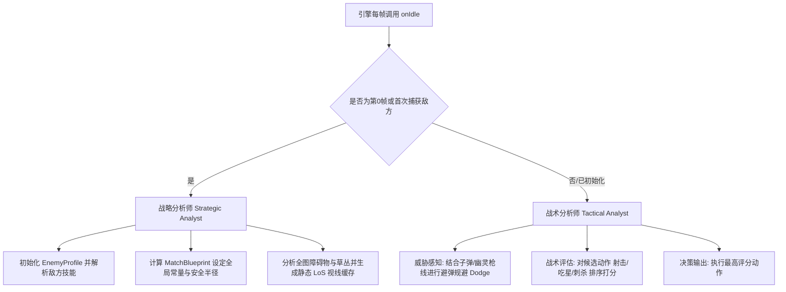

# ⚔️ AgenTank - XDB 智能坦克项目 (ID: 230)

[](LICENSE)
[](https://agentank.ai/)
[](new_tank.js)

欢迎来到 **XDB**（坦克 ID 230）的代码库！本项目为 [AgenTank](https://agentank.ai/) 平台开发了一个具备自主演进、深度战术决策、以及特化反技能特性的智能坦克机器人。本坦克搭载了**传送 (`teleport`) 技能**，致力于通过先进的寻路算法、躲避逻辑和精密的技能博弈在公开排行榜上攀升并打上王者。

> [!IMPORTANT]
> **胜负核心评价函数约束**
> 最终决策收益权重必须严格遵循：**击毁对方坦克 > 获取星星数量更多 > 运行时间更短**。如果在计算中发现了一条确凿的击杀路径，其权重必须呈现压倒性优势覆盖一切抢星逻辑；反之，严禁为了吃星而陷入死角被杀。

---

## 🧭 双层分析师架构 (Architecture)

为了在平台每帧 30ms 的严格限制下高效运行，XDB 坦克代码采用了解耦的双层分析师设计模式：



### 1. 战略分析师 (Strategic Analyst - 静态层)
- **运行机制**：在第 0 帧或首次发现敌人时运行。结果缓存于全局变量 [G_Blueprint](new_tank.js#L7) 中，避免每一帧重复计算。
- **主要职责**：
  - **敌方侧写 (Enemy Profile)**：分析敌方技能属性，预估威胁并设定特化反技能参数。
  - **全局静态缓存**：扫描地图中的硬墙壁 (`"x"`)、草丛 (`"o"`) 等，生成静态的视线缓存和路径网格，从而最大化降低动态层的开销。

### 2. 战术分析师 (Tactical Analyst - 动态层)
- **运行机制**：在每一帧 [onIdle](new_tank.js#L62) 循环中执行。
- **主要职责**：
  - **动态避弹**：检测场上可见子弹轨道，评估未来 3 帧内的碰撞点，并对有威胁的路径节点打上惩罚。
  - **决策打分**：对刺杀、射击、紧急躲避、吃星等候选动作评分，最后执行高分动作。

---

## 🛠️ 项目结构与核心文件

在开发和维护坦克时，应遵照以下文件分工：

| 文件名称 | 路径与链接 | 用途与职责说明 |
| :--- | :--- | :--- |
| **核心坦克脚本** | [new_tank.js](new_tank.js) | 生产部署代码，包含入口 [onIdle](new_tank.js#L62)、A* 寻路和决策树。 |
| **战略与战术总纲** | [STRATEGY.md](STRATEGY.md) | 坦克行为的底线逻辑，定义了胜负价值观和 8 大反技能模块的博弈细则。 |
| **开发与约束指南** | [GEMINI.md](GEMINI.md) | 项目结构规范、编码限制、测试套件用法以及回归测试的硬性规定。 |
| **AI 代理项目规范** | [AGENTS.md](AGENTS.md) | 包含初始化流程、胜负价值观、转向 API 特化和自动化脚本清单。 |
| **官方规则手册** | [AGENT_GUIDE.md](AGENT_GUIDE.md) | 本地同步的官方 API 手册、坐标系约定、以及游戏内技能冷却说明。 |
| **开发版发布脚本** | [publish.js](publish.js) | 一键发布开发版代码（包含调试喊话及注释）到平台并触发一局随机实战。 |
| **编译发布发布脚本** | [publish_dist.js](publish_dist.js) | 生产发布工具，自动剔除所有调试 `speak` 及注释生成 [dist_tank.js](dist_tank.js) 上传到平台，并触发一局随机实战。 |
| **测试框架配置文件** | [test_cases/registry.json](test_cases/registry.json) | 回归测试用例集，记录战例帧断言。 |
| **测试运行器** | [run_tests.js](run_tests.js) | 本地沙盒测试运行器，用来自动化验证重构是否引发历史 Bug。 |
| **进化日志** | [EVOLUTION_LOG.md](EVOLUTION_LOG.md) | 记录各版本的胜率迭代、修改日志 and 战术演变历史。 |

---

## 📏 核心开发与编码红线

> [!WARNING]
> **1. 坐标系数据结构红线**
> 地图上的所有坐标必须严格使用数组形式表示（如 `[x, y]`），**绝对禁止**使用对象形式（如 `{x, y}`）。处理为 `{x, y}` 会导致寻路和避弹引擎完全失效。

> [!IMPORTANT]
> **2. 转向 API 封装与转向耗时**
> 平台原生的 `me.turn(dir)` 仅合法支持 `"left"` 和 `"right"`。在任何绝对转向场景下，必须通过 [getTurnDir](new_tank.js#L68) 包装函数对朝向进行分流和分步，将其转换为相对转向。转向（旋转 90 度）消耗 1 帧，180 度掉头需要 2 帧。近距离遇弹时物理转向规避往往来不及，需要配合传送技能或使用缓冲朝向规避。

> [!CAUTION]
> **3. 静态缓存与防抖机制**
> 严禁在每帧循环中重建大型数组或重复进行全图搜索。必须引入 [G_AStarCache](new_tank.js#L51) 等帧内缓存机制，确保寻路效率。如遇死锁或震荡需触发 `stuckCounter` 降级，避免 runtime 判定平局超时。

---

## 🤖 自动化与对战脚本指南

在根目录的 `.env` 中正确配置 `AGENTANK_TOKEN` 后，即可调用以下脚本：

### 1. 自动化测试与进化
- **回归测试**：在进行任何 Git 提交或发布前，**必须**运行以下命令确保回归测试 100% 通过（PASS）：
  ```bash
  node run_tests.js
  ```
- **批量进化挑战 (30场)**：运行随机挑战测试当前的基准胜率。若比上一版本胜率提升 $\ge 5\%$ 则自动发布并 commit，若下降 $\ge 5\%$ 则自动执行回滚：
  ```bash
  node batch_evolution.js
  ```
- **定向对手挑战训练 (20场)**：定向训练和复盘特定对手：
  ```bash
  node targeted_evolution.js <敌方坦克ID>
  ```

### 2. 排位赛与上分脚本
- **排位赛无限挂机**：
  ```bash
  node ranked_battle.js infinite
  ```
- **定向高分挑战上分**：搜索当前服务器中积分最高的合格对手并持续挑战：
  ```bash
  node batch_battleforscore.js 100 best
  ```
- **挂机挑战全服第一**：每 5 秒轮询挑战当前符合条件的全服第一名，每 10 场刷新一次目标：
  ```bash
  node battle_first.js
  ```

### 3. 诊断与复盘工具
- **提取分析排位赛败局**：
  ```bash
  node summarize_rank_losses.js
  ```
- **详细解析单场录像 JSON**：
  ```bash
  node analyze_replay.js
  ```
- **本地 API 模拟运行**：
  ```bash
  node simulate_match.js
  ```

### 4. 代码打包与部署发布
- **开发版一键发布**：直接部署当前包含调试喊话及注释的开发版代码，并在 2 秒冷却后触发一场随机实战以测试行为表现：
  ```bash
  node publish.js
  ```
- **生产精简版编译发布**：编译 [new_tank.js](new_tank.js)，自动过滤掉所有的 `me.speak(...)` 可视化喊话和全部代码注释，输出超轻量化生产包 [dist_tank.js](dist_tank.js) 上传部署，最后在冷却后启动一场随机实战：
  ```bash
  node publish_dist.js
  ```

---

## 💬 可视化 Speak 调试协议 (Visual Debugging Protocol)

在分析 Replay 时，可以通过坦克头顶弹出的文字立即获知当前帧坦克所处的决策分支。核心调试埋点包括：

| Speak 喊话文本 | 调试类型 | 触发逻辑说明 |
| :--- | :--- | :--- |
| **`"传送延迟等待"`** | 传送延迟 | 传送落地 $T+1$ 帧，车头已对准星星时原地等待 1 帧消解吃星锁定 |
| **`"传送延迟转向"`** | 传送转向 | 传送落地 $T+1$ 帧，车头未准星时原地转头偏正 |
| **`"草丛盲射"`** | 战术反击 | 敌方短时间内（$\le 3$ 帧）退入草丛且处于枪线上，对其射击压制 |
| **`"刺杀预瞄"`** | 战术刺杀 | 冷却接近完成或判定安全落点时，提前原地偏转车头对准落点 |
| **`"守星撤退"`** | 守星压制 | 守星期间贴脸（距离 $\le 1$）遭遇物理子弹威胁，沿反方向后退逃生 |
| **`"幽灵避弹"`** | 紧急避险 | 场上虽无可见弹，但已知处于敌方枪口或 `overload` 超宽射线上，偏轴规避 |
| **`"共轴避弹"`** | 紧急避险 | 处于潜在的敌方草丛共轴危险射线上且自身暴露时，偏轴规避 |
| **`"安全规避"`** | 紧急避险 | 近距离可见敌人对准我方且无掩体，紧急位移或找草丛隐蔽 |
| **`"发现了子弹"`** | 避弹预警 | 敌方子弹进入我方前方 90° 扇形视野区，首次捕获时喊话提醒 |

---

## 📁 历史诊断报告归档 (Rank Analysis Reports)

每次排位诊断生成的正式分析报告均归档于此：
- [排位分析报告 - 2026.05.15 (16:45)](rank_reports/REPORT_20260515_1645.md) —— 首版针对 A* 剪枝和危险逃逸的性能分析。
- [排位分析报告 - 2026.05.15 (17:30)](rank_reports/REPORT_20260515_1730.md) —— 反 Cloak 与近身物理规避性能瓶颈分析。

---

*让 XDB 坦克在 AgenTank 的赛场上无可匹敌！*
